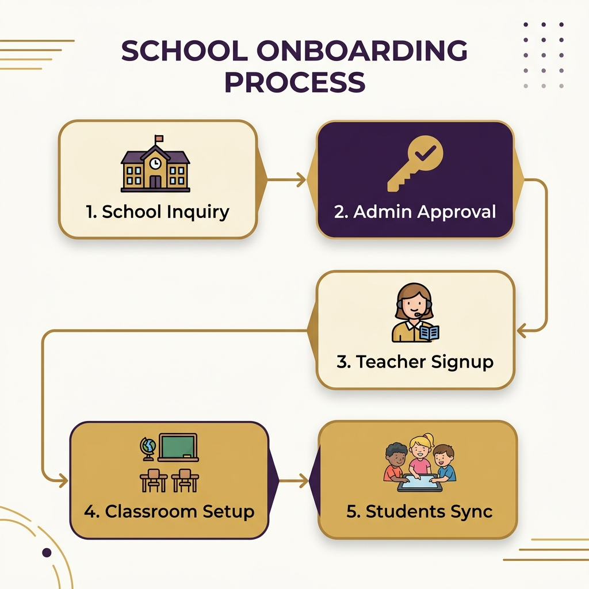
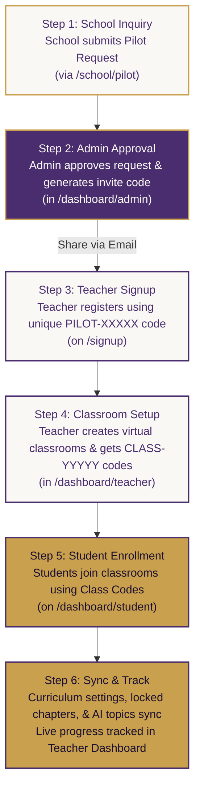

# Young AI Explorers — Onboarding Flowchart

This document details the secure, two-stage onboarding process designed for schools, teachers, and students on the **Young AI Explorers** platform. 

---

## Detailed Step-by-Step Breakdown

### 📋 Step 1: School Inquiry Submission
* **Who:** School Administrators or Principals.
* **Action:** Submits a form at `/school/pilot` requesting a pilot license for their school.
* **Why:** Initiates the institutional relationship and acts as a security gate to filter real schools from public signups.

### 🛡️ Step 2: Admin Approval & Code Generation
* **Who:** Platform Administrator.
* **Action:** Approves the inquiry inside the **Admin Console** (`/dashboard/admin`). 
* **Outcome:** The system creates a new `school_pilot` license and generates a unique, secure code (e.g., `PILOT-DPXPG`). A premium share modal copies the code and drafts a pre-filled invitation email to the school's contact.

### 👤 Step 3: Teacher Registration
* **Who:** School Teachers/Educators.
* **Action:** Signs up at `/signup`, selecting the **Teacher / Educator** role and entering their unique school pilot code.
* **Outcome:** The teacher's profile is securely linked to the school pilot license, unlocking the Educator Portal.

### 🏫 Step 4: Classroom Creation
* **Who:** Registered Teachers.
* **Action:** Creates virtual classrooms (e.g. "Year 5 AI Stars") in the **Teacher Dashboard**.
* **Outcome:** The system generates a specific class code (e.g., `CLASS-R2XCV`) for each classroom.

### 🎒 Step 5: Student Joining
* **Who:** Students / Pupils.
* **Action:** Registers as a student and enters the Class Code in the **Join a Classroom** form on their dashboard.
* **Outcome:** The student is added to the teacher's roster and their learning analytics sync automatically.

### ⚙️ Step 6: Real-Time Sync & Progress Tracking
* **Who:** Teacher & Student Dashboards.
* **Sync Action:** 
  1. **Lock/Unlock Chapters:** Toggling a chapter off in the Teacher Dashboard instantly hides it from student maps.
  2. **Custom AI Lessons:** Generating custom AI lessons (via Vision Vee) instantly pushes them as new chapters to all enrolled students.
* **Grading Action:** The teacher's roster compiles live student reading progress, quiz scores, and badges earned.
